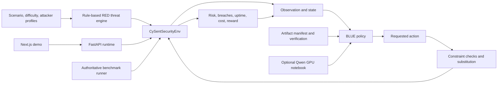

# CySent

CySent is an experimental autonomous cyber-defense simulation and evaluation
platform for comparing BLUE policies against seeded, profile-driven RED
behavior. It studies a sequential decision problem: given the current security
condition of a dynamically attacked enterprise network, what defensive action
should be taken now to reduce future damage while preserving availability?

CySent is a research simulator, not production EDR, SIEM, SOC infrastructure,
or evidence of real-network protection.

## Why CySent

Cyber defense is not a single-label classification problem. A defensive action
can reduce one risk while consuming budget, causing downtime, entering
cooldown, or changing what is possible on the next turn. CySent makes those
trade-offs measurable and evaluates policies using reward, breaches, risk,
uptime, action cost, survival, and requested-versus-executed behavior.

The primary research focus is BLUE policy behavior. RED is configurable,
profile-driven adversarial logic; it is not learned RL, MARL, self-play, or a
trained adversarial policy.

## What It Evaluates

The experimental loop is:

```text
RED threat engine -> cyber environment -> observation/state -> BLUE policy
-> requested action -> constrained execution -> security outcome + reward
-> next state
```

The Gymnasium-compatible environment exposes a 67-value observation to PPO
policies and a discrete 12-action BLUE interface. The environment may replace
a requested action when constraints such as cooldowns or action validity make
it unavailable. CySent therefore records requested and executed actions
separately.

## Architecture



The frontend is an observable local demo interface. Scientific comparisons
are produced by `backend/train/benchmark_agents.py`, not by the UI or the
deprecated API benchmark endpoint. See [Architecture](docs/architecture.md)
for component and data-contract details.

## BLUE Policies

| Identity | Method | Live/demo status | Artifact requirement | Evaluation status |
|---|---|---|---|---|
| `random` | Seeded random baseline | Live | None | Frozen P1/P2 evidence |
| `heuristic` | Deterministic visible-state rules | Benchmark-only | None | Frozen P1/P2 evidence |
| `ppo_historical_checkpoint` | Stable-Baselines3 PPO | Live when verified | External checkpoint | Frozen P1/P2 evidence |
| `ppo_fresh_checkpoint` | Fresh Stable-Baselines3 PPO | Benchmark-only | External checkpoint | Frozen P2 evidence |
| `qwen_rl` | Historical constrained Qwen policy | Live when verified | Immutable merged snapshot and practical GPU | Real-model smoke; controlled benchmark incomplete |
| `hybrid_router` | Historical PPO with risk/periodic Qwen routing | Live when both dependencies are verified | Historical PPO and Qwen artifacts | Unit-tested; real-model evaluation incomplete |

Generic generative `HFAgent` support remains available only under the separate
legacy identity `hf_generative_legacy`; it is not the canonical `qwen_rl`
research policy.

## Frozen Results

### P1: controlled baseline matrix

P1 evaluated Random, Heuristic, and Historical PPO over three seeds and three
fixed cases, for 27/27 completed episodes with no failures. Values are means
over nine episodes per policy.

| Policy | Reward | Breach rate | Mean risk | Final risk | Uptime | Defensive cost | Survival |
|---|---:|---:|---:|---:|---:|---:|---:|
| Random | 58.1793 | 0.1111 | 0.1112 | 0.1066 | 0.9054 | 16.0544 | 144.56 |
| Heuristic | 71.3276 | 0.1587 | 0.1754 | 0.2356 | 0.9320 | 10.8656 | 113.22 |
| Historical PPO | -41.3488 | 0.2063 | 0.2731 | 0.3821 | 0.8319 | 6.6844 | 111.11 |

Heuristic produced the highest reward and uptime in this matrix, while Random
had lower breach/risk values and longer survival. This is evidence that reward
and operational/security outcomes must be interpreted together, not a claim
that one policy is globally best. Historical PPO requested
`investigate_top_alert` on 1000/1000 decisions; 498/1000 executions were
substituted to `do_nothing`.

Evidence: [`outputs/benchmarks/p1_baseline_v2/`](outputs/benchmarks/p1_baseline_v2/)

### P2: Fresh PPO controlled evaluation

Fresh PPO was added to the same frozen evaluation matrix, producing 36/36
completed four-policy episodes with no failures. The Fresh PPO row below is
reported separately because it was introduced in the P2 experiment.

| Policy | Reward | Breach rate | Mean risk | Final risk | Uptime | Defensive cost | Survival |
|---|---:|---:|---:|---:|---:|---:|---:|
| Fresh PPO | -37.5918 | 0.1905 | 0.2648 | 0.3507 | 0.8375 | 6.9178 | 110.89 |

Fresh PPO requested `investigate_top_alert` on 967/998 decisions and
`increase_monitoring` on 31/998. Executed actions were 490 investigations, 477
no-ops, and 31 monitoring actions. Its episode-mean substitution rate was
48.16% and its episode-mean repeat rate was 98.61% (pooled: 47.80% and
98.18%). This is highly concentrated, near-collapsed deterministic benchmark
behavior. Diagnostics identify several plausible contributing factors, but do
not establish one definitive cause.

Evidence: [`outputs/benchmarks/p2_fresh_ppo_primary/`](outputs/benchmarks/p2_fresh_ppo_primary/)

See [Experiments and Evidence](docs/experiments.md) for matrices, aggregation,
standard deviations, action behavior, and provenance limitations.

## Qwen Historical-Policy Finding

The historically faithful Qwen evaluator does not generate free-text actions.
It gathers the first-token logit for each of the 12 canonical action names and
samples from the resulting constrained categorical policy. Those 12 action
categories contain only 10 unique first-token IDs. `patch_hr_systems`,
`patch_web_server`, and `patch_auth_server` share one token and therefore have
identical constrained logits and probabilities.

CySent preserves this historical limitation under policy identity
`historical_first_token_seeded_categorical_v1`. Evaluation uses the model's
FP16 forward pass on the verified T4 run, FP32 normalization of the 12 gathered
logits, and seeded categorical sampling with an agent-local CPU generator.

A real merged-model smoke test succeeded on three seed-42 scenarios and
produced valid environment steps while reproducing the collision. This proves
artifact loading and faithful policy execution, not comparative performance.
The controlled Qwen benchmark remains incomplete.

## Hybrid Status

The Hybrid Router is implemented and unit-tested. It ordinarily uses
Historical PPO, invokes Qwen when network risk is greater than `0.7` or on the
configured periodic turn, and may fall back to Historical PPO with a recorded
reason when a runtime Qwen decision fails.

Real-model Hybrid smoke repeatedly caused abrupt Colab kernel termination. No
Python exception or explicit host/CUDA OOM was captured; the cause remains
unresolved. Controlled Hybrid performance has not been measured.

## Quick Start

The artifact-free CPU path is the v1 minimum reproducible demo.

```powershell
python -m venv .venv
.\.venv\Scripts\Activate.ps1
python -m pip install --upgrade pip
python -m pip install -r backend/requirements-cpu.txt
npm --prefix frontend ci
```

Start the backend:

```powershell
.\.venv\Scripts\python.exe -m uvicorn backend.api.main:app --host 127.0.0.1 --port 8000
```

In a second terminal, start the frontend:

```powershell
npm --prefix frontend run dev -- --hostname 127.0.0.1 --port 3000
```

Open `http://127.0.0.1:3000`. Random is the default artifact-free live policy.
The UI also exposes compact manual BLUE actions. `/agents` reports which
artifact-dependent policies are actually available; unavailable policies are
not silently substituted.

## Reproducing Experiments

- [CySent v1 run guide](docs/v1-run.md)
- [Experiments and evidence](docs/experiments.md)
- [Architecture and contracts](docs/architecture.md)
- [Artifact manifest](configs/artifacts_v1.json)

Random and Heuristic evaluation is reproducible from a fresh clone on CPU.
Historical and Fresh PPO require external checkpoints matching their manifest
hashes. Qwen requires the pinned external merged-model snapshot and a CUDA GPU
for the evaluated local path. The original SFT/RL training notebooks are
historical material, not required for v1 CPU reproduction.

## Repository Structure

```text
backend/env/                 Simulation, RED engine, risk, and reward
backend/agents/              Canonical policy implementations and router
backend/api/                 FastAPI demo runtime
backend/train/               PPO training and authoritative benchmark runner
configs/                     Frozen training and artifact contracts
frontend/                    Next.js local demo interface
docs/                        Architecture, evidence, and run guides
notebooks/                   Historical training and optional Qwen evaluation
outputs/benchmarks/          Tracked frozen P1/P2 evidence
```

## Limitations

- CySent is a simulation and does not establish production network protection.
- RED is profile-driven automated logic, not a learned adversarial policy.
- The benchmark matrix is small; no statistical significance or broad
  external validity is claimed.
- Historical and Fresh PPO showed concentrated deterministic behavior and
  substantial requested-to-executed substitution.
- The historical Qwen policy has a first-token action collision.
- Controlled Qwen and Hybrid benchmarks are incomplete; Hybrid real-model
  termination remains unresolved.
- PPO and Qwen artifacts are external and are not stored in Git.
- P5 automated validation passed, but manual browser verification of visual
  interactions and replacement screenshots remains pending.

## Future Work

- Diagnose the constrained-GPU Hybrid termination.
- Complete controlled Qwen and Hybrid evaluation.
- Explore a Qwen v2 policy with unique action scoring while preserving v1.
- Improve PPO observability and action-validity handling.
- Extend reward-alignment analysis, seeds, scenarios, OOD evaluation, and
  ablations.
- Redesign the frontend after the v1 research record is frozen.

## Project Status

CySent v1 has a frozen simulation baseline, reproducible CPU baselines,
Historical and Fresh PPO evidence, faithful Qwen policy reconstruction,
artifact contracts, and a truthful local demo interface. The broader research
program is not complete: controlled Qwen/Hybrid evaluation, Hybrid crash
diagnosis, manual P5 browser verification, and refreshed screenshots remain
open.
