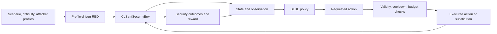
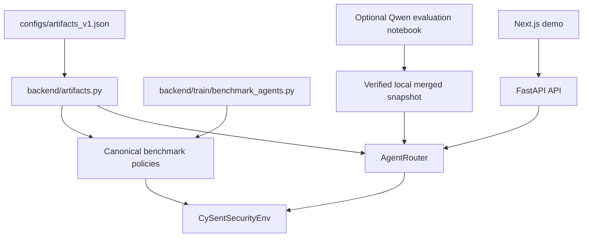

# CySent v1 Architecture and Contracts

## Scope

CySent is an experimental autonomous cyber-defense simulation and evaluation
platform. It evaluates BLUE defensive policies under controlled, dynamic RED
pressure. It is not production network protection.

## Research Loop

RED is seeded, configurable adversarial logic. It selects attacks, targets,
multi-turn campaign progression, stealth, and pressure from scenario,
difficulty, attacker profiles, and prior BLUE context. It is not learned RL,
MARL, self-play, or a trained attacker.

`CySentSecurityEnv` owns episode reset/step semantics, assets, action
constraints, delayed effects, cooldowns, alerts, budget, RED application,
risk/reward calculation, termination, and replay/event data.

## State and PPO Observation

The environment's API state contains assets, risk breakdown, RED activity,
alerts, defender budget/cooldowns, profiles, events, and deterministic
advisory data.

The PPO observation is narrower: 67 normalized values consisting of nine
features for each of seven assets plus four global values. The per-asset
features are patch level, infected, isolated, compromised, criticality,
credential risk, detection level, backup health, and uptime. Global values are
network risk, compromised ratio, downtime ratio, and normalized honeypot
timer.

Alerts, cooldowns, and other internal state are not directly included in this
67-value PPO vector. API state and PPO observation must not be described as
identical.

## BLUE Action Contract

The discrete action space has 12 canonical actions:

1. `do_nothing`
2. `patch_hr_systems`
3. `patch_web_server`
4. `patch_auth_server`
5. `rotate_credentials`
6. `isolate_suspicious_host`
7. `increase_monitoring`
8. `restore_backup`
9. `deploy_honeypot`
10. `phishing_training`
11. `investigate_top_alert`
12. `segment_finance_database`

A policy requests an action. The environment may execute a different action
when the request is blocked by the current state, cooldown, budget, or another
constraint. Every evaluation path therefore preserves both
`selected_action_name` (requested) and `action_name` (executed).

## Outcomes and Reward

The environment reports network and asset risk, compromise, uptime, RED
success/prevention, action cost, survival, termination reason, and reward.
Reward combines risk, breach, availability, recovery, prevention, critical
asset, action-economy, repetition, and terminal signals, then clips the result
to the configured range.

Reward is a shaped experimental objective, not a complete security outcome.
Comparisons must consider reward together with breach rate, risk, uptime,
cost, survival, action diversity, and substitutions.

## Canonical BLUE Identities

- `random`: seeded artifact-free live and benchmark baseline.
- `heuristic`: deterministic benchmark-only baseline using visible state.
- `ppo_historical_checkpoint`: live/benchmark PPO when its exact checkpoint is
  available and verified.
- `ppo_fresh_checkpoint`: benchmark-only Fresh PPO using its verified best
  checkpoint.
- `qwen_rl`: historically faithful local constrained Qwen policy when the
  immutable merged snapshot is verified.
- `hybrid_router`: Historical PPO plus risk/periodic Qwen routing when both
  dependencies are available.

`hf_generative_legacy` is a separate compatibility capability. It is not
`qwen_rl` and is not an authoritative research identity.

## Hybrid Routing

Hybrid increments its episode turn counter before routing. It selects Qwen
when network risk is greater than `0.7` or when the counter is divisible by
the configured periodic threshold (currently 10). Other turns use Historical
PPO. A runtime Qwen decision failure may fall back to verified Historical PPO
with a nonempty recorded reason. Missing startup dependencies make Hybrid
unavailable rather than silently degraded.

## Runtime and Evaluation Paths

### FastAPI backend

The API provides health/state, canonical agent availability, reset,
autonomous/manual stepping, metrics, and replay access. `/step` returns the
authoritative server turn, requested and executed actions, action mode,
canonical execution source, reward, terminal state, RED activity, and optional
fallback reason. The legacy API benchmark endpoint is disabled.

### Frontend demo

The frontend is a local observability and interaction layer. It defaults to
Random, consumes `/agents`, prevents unavailable policies from being started,
shows requested/executed provenance, supports manual actions and paused replay,
and labels deterministic simulation advisory output separately from policy
reasoning. It is not the benchmark authority.

### Authoritative benchmark runner

`backend/train/benchmark_agents.py` is the controlled comparison path. It
fixes the scenario matrix, propagates episode seeds, records raw episode rows,
requested/executed distributions, substitutions, repetition, failures,
source/artifact metadata, and aggregate summaries. Qwen/Hybrid execution adds
immutable model metadata and resumable per-episode persistence.

### Artifact verification

`configs/artifacts_v1.json` binds PPO identities to exact paths and SHA-256
hashes. `backend/artifacts.py` verifies those files before use. Canonical Qwen
readiness requires the expected Hugging Face cache repository layout at the
immutable merged-model revision; arbitrary directories and mutable names are
not accepted.

The Qwen verifier establishes canonical snapshot identity from the immutable
cache path. It does not cryptographically prove the complete upstream SFT/RL
training lineage or hash the full model weights.

### Optional Qwen notebook

`notebooks/cysent_qwen_evaluation.ipynb` resolves and downloads the exact
merged-model revision, loads the real local policy on CUDA, verifies policy
identity, runs smoke cases, and can invoke the resumable benchmark runner.
Benchmark execution remains disabled by default. Colab is evaluation compute,
not part of the runtime architecture.
